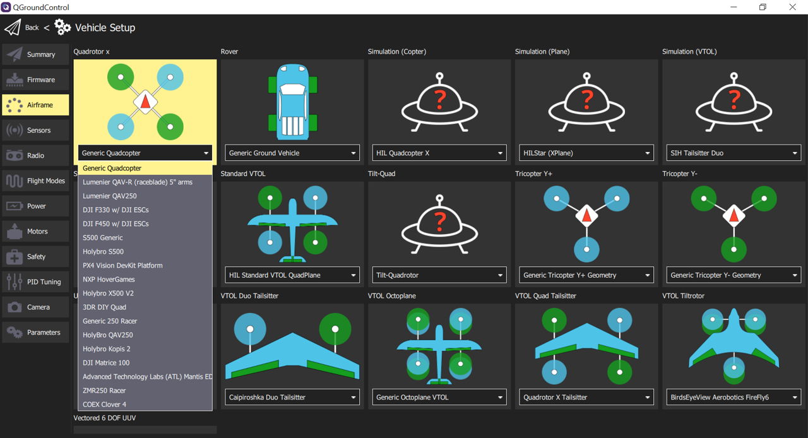
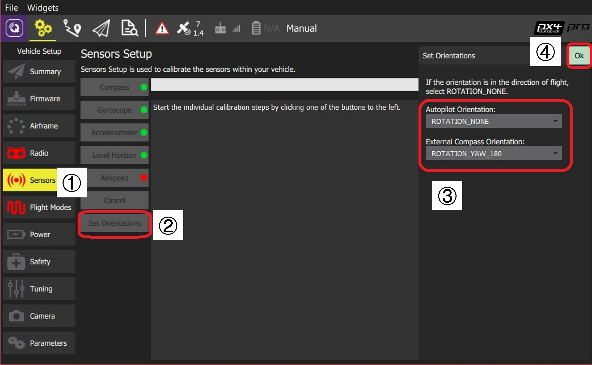

**Standard Configuration**

- Video Guide of the calibration process in detail
  
  - [PX4 Autopilot Setup Tutorial Preview - YouTube](https://youtu.be/91VGmdSlbo4)
  
  - older version of QGroundControl (QGC) is used in video, the process in general is unchanged. 

Open `Vehicle Setup` in QGroundControl 

1. Select `Q icon` (on the top left)

2. Select `Vehicle Setup` in the pop up window

# Firmware

> **WARNING** Disconnect all USB connections to the vehicle (both direct and through a telemetry radio) before starting installing Firmware.
> 
> <!--e.g. the onboard computer at **`TELEM2`**-->

## Install PX4

1. In QGC > `vehicle setup` > `Firmware`.
   
   

2. Connect the flight controller <u>directly</u> to your computer via USB.
   
   - directly to a powered USB port, not a USB hub

3. Select __PX4 Pro Stable Release v1.13.0_ on the right side bar
   
   - The <u>latest release version</u> will be auto-detected. 
   
   - 
   
   - To install another version, select `Advanced settings`
     
     - `Standard Version (stable)`: The default version, no difference to Stable Release above (i.e. no need to use the advanced settings to install this)
     - `Beta Testing (beta)`: A beta/candidate release. Only available when a new release is being prepared.
     - `Developer Build (master)`: The latest build of PX4/PX4-Autopilot.
     - `Custom Firmware file...`: A custom firmware file (e.g. that you have built locally). If you select this you will have to choose the custom firmware from the file system in the next step.

4. Click `OK` to install the firmware
   
   - QGC will download the new firmware, erasing old firmware, etc. 
   
   - Flashing the firmware
   
   - 
   
   - Once the firmware has completed loading, the device will reboot and reconnect. 
   
   - Rebooted after firmware flashing completed
   
   - 

> For installing FMUv2 on a newer board, please follow this chapter, [Loading Firmware | PX4 User Guide](https://docs.px4.io/main/en/config/firmware.html#fmuv2-bootloader-update)

# Airframe

## Set the Airframe

1. In QGC > `vehicle setup` > `Airframe`

2. Select the broad vehicle group/type that matches your airframe and then use the dropdown within the group to choose the airframe that best matches your vehicle.
   
   - 

3. Click `Apply and Restart` on the top right of the page, and click `Apply` to save the settings and the vehicle will be rebooted
   
   - 

# Sensor Orientation

## Sensor Orientation

Roll, pitch, and yaw offsets of vehicles are shown below

The default orientation of the flight controller is pointing towards the front of the vehicle.

The angle of the yaw offsets for different cases

> For a VTOL Tailsitter airframe, use its <u>multirotor configuration</u> (i.e. takeoff, hovering, landing) as orientation setting. 

## Setting the Orientation 

1. Open `Vehicle Setup` > `Sensors` 

2. Select `Set Orientations`

3. Select the rotation in `Autopilot Orientation` (For external compass) select `External Compass Orientation` in the same way

4. Press `OK`
   
   - 

# Compass

## Types of Compass Calibration

- [**Complete**](#complete_calibration)
  
  - Required after <u>installing the autopilot for the first time</u> on an airframe or when <u>the config has changed significantly</u>.
  
  - It compensates for hard and soft iron effects by estimating an offset and a scale factor for each axis.

- [**Partial**](#partial_calibration)  (quick calibration)
  
  - a routine when preparing the vehicle for a flight, after changing the payload, or when the compass rose seems inaccurate. 
  
  - this calibration only estimates the offsets to compensate for a hard iron effect

> Once again, an external GPS should be mounted as far as possible from other electronics and in supported orientation

Indications of a poor compass calibration

- multicopter circling during hover

- toilet bowling (circling at increasing radius/spiraling-out, usually constant altitude, leading to fly-way) 像在冲水的漩涡一样

- veering off-path when attempting to fly straight

## Complete Calibration 

> Find a place <u>away from large metal objects or magnetic fields</u> to perform the calibration

1. Connect to the vehicle

2. QGC > `Vehicle Setup` > `Sensors`

3. Check autopilot orientation has been set already. If not, set it following the steps in [Sensor Orientation](#setting_orientation). 

4. Click  on `Compass`

5. Click `OK` on the top right to start the calibration
   
   - 

6. 1. Place the vehicle in any of the orientations incomplete (in red) and hold it still for a while. 
      
      > Not necessary to follow the sequence of the boxes from left to right, top to bottom, you can calibrate the _six_ orientations in any sequence
   
   2. Once the box turns yellow, rotate the vehicle around the specified axis <u>in either/both directions</u> until the box turns to green.
   
   

7. Repeat step 6 for the rest incomplete orientations. 

8. Process for next sensor or reboot your vehicle

## Partial Calibration 

This calibration is similar to the well-known figure-8 compass calibration done on a smartphone:

1. Hold the vehicle and randomly perform <u>partial rotations</u> on all axes
   
   - 2-3 oscillations of ~30 degrees in every direction is recommended

2. Wait for the heading estimate to stabilize, and verify that the compass rose is pointing to the correct direction (can take a couple of seconds).

Notes: 

- There is no start/stop for this type of calibration (the algorithm runs continuously when the vehicle is disarmed).

- The calibration applies immediately (no reboot required)

- The calibration parameter is saved <u>only after disarming the vehicle</u>
  
  - The calibration parameter will be lost if no arming/disarming sequence is performed between calibration and shutdown
  
  - Arm/disarm the drone after calibration before shutdown to save the calibration parameters.

- The amplitude and the speed of the partial rotations done in step 1 can affect the calibration quality. However, 2-3 osc   illations of ~30 degrees in every direction is usually enough.

# Gyroscope

## Gyroscope calibration

1. QGC > `Vehicle Setup` > `Sensors` > `Gyroscope`

2. Place the vehicle on a surface and leave it still

3. Click `OK` on the top right
   
   - 

4. Don't move the vehicle until the progress bar moves to the right, and the box turns green. 
   
   - 

# Accelerometer

Indications of a poor accelerometer calibration

- in preflight checks and arming-denied messages

- "high accelerometer bias" and "consistency check failures"

## Accelerometer calibration

1. Connect to the vehicle

2. QGC > `Vehicle Setup` > `Sensors`

3. Check autopilot orientation has been set already. If not, set it following the steps in [Sensor Orientation](#setting_orientation).

4. Click on `Accelerometer`

5. Click `OK` on the top right to start the calibration
   
   - 

6. 1. Place the vehicle in any of the orientations incomplete (in red).
      
      > Not necessary to follow the sequence of the boxes from left to right, top to bottom, you can calibrate the *six* orientations in any sequence
   
   2. Once the box turns yellow, hold it still for a while until the box turns to green.
      
      > Not necessary to have "perfect" 90 degree orientations as the calibration uses a least squares 'fit' algorithm. 
      > As long as during the calibration sequence, each axis is pointed mostly up and down at some time and the vehicle is held stationary 
      
       

7. Repeat step 6 for the rest vehicle orientations. 

# Airspeed

skipped, refer to the [Airspeed Calibration | PX4 User Guide](https://docs.px4.io/main/en/config/airspeed.html)

# Level Horizon

Leveling the horizon is highly recommended. It can result in the best flight performance. Once you notice a constant drift during flight, repeat the leveling horizon calibration.

## Level horizon calibration

Set the Autopilot orientation in advance

1. QGC > `Vehicle Setup` > `Level Horizon`

2. Place the vehicle in its level flight orientation on a level surface: 
   
   - (For planes) the position during level flight (<u>planes tend to have their wings slightly pitched up!</u>)
   
   - (For copters) the hover position

3- Press `OK` to start the calibration

4- Wait until the calibration finishes

## Verification

After the orientation is set and level-horizon calibration is complete, check in the flight view that the heading in the compass shows a value around 0 when you point the vehicle towards north and that the horizon is level (blue on top and green on bottom).

     

# Radio Setup 

## Binding the Receiver

FrSky receiver, follow the instructions here [How to bind FrSky X8R receiver to Taranis X9D transmitter in D16 mode - YouTube](https://www.youtube.com/watch?v=1IYg5mQdLVI)

Steps for _FrSky L9R_ receiver as an example:

1. Disconnect the receiver from power

2. Press and hold the _Failsave_ (F/S) button while connect it to power
   
   - PX4 `RCIN` channel, receiver `SBUS` channel
   
   - The green and red lights will be on at the same time

3. Start binding on the transmitter
   
   - From the main interface, ***MENU*** > ***PAGE*** to open `MODEL SETUP` > near the bottom `Internal RF` > `Receiver No.` > `[bind]`, press ***ENT***, you will hear beep sound from the transmitter
   
   - On the receiver, the red light will be flashing, and green light remains on

4. Turn off the receiver and transmitter
   
   - turning off transmitter may not be necessary

5- Turn on both

- the green light will be on (red light off)

Binding process is completed

## RC Loss Detection

PX4 needs to detect signal loss from RC controller in order to take appropriate safety measures. 

Ways of RE receivers indicating signal loss:

- Output nothing (automatically detected by PX4)

- Output a low throttle value (can configure PX4 to detect this)

- Output the last received signal (*<u>cannot</u>* be detected by PX4, as it looks like a valid input)

If RC receiver does not support no signal output on signal loss, you have to configure it to set throttle low instead, and set the corresponding value in `RC_FAILS_THR`

> DO NOT use a receiver that cannot support one of the two supported RC loss detection methods

## RC Calibration

Demo video [PX4 Autopilot Setup Tutorial Preview - YouTube](https://youtu.be/91VGmdSlbo4?t=4m30s)

1. Turn on RC transmitter

2. Start QGC and connect the vehicle

3. `Vehicle setup` > `Radio`

4. Press `Calibrate`

5. Press `OK` to start calibration
   
   - 

6. Select the transmitter mode that matches your transmitter
   
   - `Mode 2` by default

7. Follow the instructions and the diagram to finish the calibration
   
   7.1 Move the sticks to the position indicated by text and diagram
   
   7.2 Move all other switches and dials through their full range
   
   > For no responding when moving switches, please [map the switches to channels](file:///C:/D_Drive/github_repo/PX4-user_guide/notes/transmitter.pdf). 
   
   - 

8. Press `Next` to save settings

# Flight Modes

> Prerequest: [Configured your radio](#radio_setup)

## Flight Modes and Switches to set

Flight modes should set:

- **Position mode** - Easiest and safest mode for manual flight

- **Return mode** - Return to launch position by safe path and land

- VTOL Transition Switch - not capable for quadrotors

Common modes:

- **Mission** - run a pre-programmed mission sent by ground control station

- **Kill Switch** - Immediately stops all motor outputs (the vehicle will crash, which may be more desirable than allowing it to continue flying in some circumstances)

## Flight Mode Selection

1. Connect the vehicle and turn on RC transmitter

2. QGC > `Vehicle Setup` > `Flight Modes`

3. Select the channel to control `Mode Channel`

4. Move the switch that set up for mode selection in step 3, the mode slot of the current switch position will be highlighted in yellow. 

5. Select the flight mode for each switch position.
   
   - 

6. Select the channels you want to map to some specific actions, e.g. Return mode, Kill switch, etc.

> Mode Channel Channel 9
> 
>     Flight Mode 1 Manual
> 
>     Flight Mode 4 Altitude
> 
>     Flight Mode 6 Position
> 
> Emergency Kill switch channel Channel 12
> 
> Return switch channel Channel 10

# Battery

Methods can be used to estimate the capacity:

- **Basic Battery Settings**(default) - A coarse estimation by comparing the raw measured voltage to the voltage range of "empty" to "full". 

- **Voltage-based Estimation with Load Compensation** - Counteracts the effects of loading on the capacity calculation.

- **Voltage-based Estimation with Current Integration** - Fuses the load-compensated voltage-based estimate for the available capacity with a current-based estimate of the charge that has been consumed. This results in a capacity estimate that is comparable to that of a smart battery.

> To ensure the battery failsafe is managed by PX4 instead of ESC, disable ESC's low voltage cutoff or set it below expected minimum voltage. 

[Battery-Type Comparison](#battery-type-comparison) below explains the difference between the main battery types, and how that impacts the battery settings.

>  The parameters `BAT1_xxx` used in the following refers to battery 1, if more than one battery is used, just replace `1` by the corresponding battery number.

## Basic Battery Settings (default) 

Configuration of basic settings for <u>battery 1</u>:

1. Connect vehicle
   
    

2. QGC > `Vehicle Setup` > `Power`

3. Set number of cells (in Series) `BAT1_N_CELLS`
   
   > If the number of cells is not supplied, it can be calculated by dividing the battery voltage by nominal voltage (3.7V) 

4. Set Empty Voltage (per cell) `BAT1_V_EMPTY`
   
   - Value too low may over-discharge and damage the battery, too high may limit the flight time
   
   - A rule of thumb for LiPo:
     
     - "Real" minimum (voltage under load/while flying : **<u>3.5V</u>**
     
     - Conservative (voltage under no-load): 3.7V

5. Set Full Voltage (per cell) `BAT1_V_FULL`
   
   - LiPo: 4.05V (default in QGroundControl)

6. Set Voltage Divider `BAT1_V_DIV`
   
   - Measure the battery voltage using a multimeter
   
   - Click `Calculate` beside `Voltage divider` 
   
   - Key in the voltage value measured above to `Measured voltage`
   
   - Click `Calculate`, and `Close` the pop-up window

7. Set Amps per volt `BAT1_A_PER_V`
   
   > Not needed for basic configuration
   
   - Measure the current of the battery
   
   - Click `Calculate` beside `Amps per volt`
   
   - Key in the current value measured above to `Measured current`
   
   - Click `Calculate`, and `Close` the pop-up window
   
   - 

## Voltage-based Estimation with Load Compensation 

Follow [the basic configuration](#basic_settings), but set a higher value (than without compensation) for _Empty Voltage_ (`BAT_V_EMPTY`). Then perform one of the following methods by setting either of the two parameters:

- **Current-based Load Compensation (recommended)**
1. Set parameter `BAT1_R_INTERNAL` to the internal resistance of battery 1 (and other batteries for the parameter respectively)
   
   > There are LiPo chargers can measure the internal resistance. A typical value is 5mΩ per cell, this can vary with discarge current rating, age and health of the cells

2. Calibrate _Amps per volt divider_ in the basic settings
- **Thrust-based Load Compensation**
1. Set the parameter `BAT1_V_LOAD_DROP` to the voltage drop a cell under the load of full throttle

## Voltage-based Estimation with Current Integration

1. Follow the steps in [current-based load compensation](#current_based_load_compensation), including *calibrating the Amps per volt divider*

2. Set `BAT1_CAPACITY` to around 90% of the advertised battery capacity (it usually printed on the battery label)

> This would give you a very accurate measurement of the relative battery consumption. If set up correctly, and with a healthy and fresh charged battery on every boot, the estimation quality will be comparable to that from a smart battery. 

## Battery Type Comparison 

**Overview**

- Li-Ion batteries have a higher energy density than LiPo battery packs but lower discharge rate and higher battery cost.

- LiPo are readily available and common in multi-roter aircraft

- **LiPo**
  
  - Advantages
    
    - Wide range of sizes, capacities and voltages
    
    - Inexpensive
    
    - High charge rates and C ratings (discharge rates relative to capacity)
  
  - Disadvantages
    
    - Low energy density (relative to Li-Ion)
    
    <!-- - Varying quality (due to abundance of suppliers) this line sounds weird-->

- **Li-Ion**
  
  - Advantages
    
    - High energy density (up to 60% higher)
  
  - Disadvantages
    
    - Expensive
    
    - Limited choices of size and configurations
    
    - Lower charge rates and C rating
    
    - Difficult to adapt to vehicles that require high currents
    
    - Requires more stringent temperature monitoring during charge and discharge

**C Ratings**

- A C rating is simply a multiple of the stated capacity of any battery type.

- relevant to but differs from both charge and discharge rates. 
  
  - Example: 2000 mAh battery (irrespective of voltage) with a 10C discharge rate can safely and continously discharge 20 amps of current ( $2000\text{mAh} \times 10\text{C} = 2\text{Ah} \times 10\text{C} = 20 \text{A}$ )

- C Rating is always given by the manufacturer (often on the outside of the battery pack)
  
  - It can actually be calculated, with serval pieces of information including the measurement of internal resistance of cells.

- Following manufacturer guidelines for both charge and discharge C ratings is very important for the health of your battery and to operate your vehicle safely
  
  - i.e. reduce fires, “puffing” packs and other suboptimal states during charging and discharging

# Safety Configuration (Failsafe)

Safety features to protect and recover vehicle if something goes wrong:

- <u>Failsafe</u> allow you to specify areas and conditions under which you can safely fly, and the [action](#failsafe-actions) that will be performed if a failsafe is triggered
  
  - The most important failsafe settings are configured in QGC `Safety Setup` [page](#qgroundcontrol-safety-setup), others can be configured via [parameters](#other-safety-settings).

- [Safety switches](#emergency-switches) on the remote control can be used to immediately stop motors or return the vehicle in the event of a problem.

## Failsafe Actions 

Some of the common failsafe actions:

| Action                                                     | Description                                                                                                                                                                                                                                                                                                 |
| ---------------------------------------------------------- | ----------------------------------------------------------------------------------------------------------------------------------------------------------------------------------------------------------------------------------------------------------------------------------------------------------- |
| None/Disabled                    | No action (the failsafe will be ignored).                                                                                                                                                                                                                                                                   |
| Warning                       | A warning message will be sent to *QGroundControl*.                                                                                                                                                                                                                                                         |
| Hold mode                        | The vehicle will enter *Hold mode*.  Hover for multicopters, circle for fixed wing.                                                                                                                                                                                                                     |
| Return mode                    | The vehicle will enter *Return mode*.  Return behaviour can be set in the [Return Home Settings](#return-mode-settings) (below).                                                                                                                                                                        |
| Land mode                        | The vehicle will enter *Land mode*, and lands immediately.                                                                                                                                                                                                                                                  |
| Flight termination | Turns off all controllers and sets all PWM outputs to their failsafe values (e.g. `PWM_MAIN_FAILn`, `PWM_AUX_FAILn`).  The failsafe outputs can be used to deploy a parachute, landing gear or perform another operation. For a fixed-wing vehicle this might allow you to glide the vehicle to safety. |
| Lockdown                     | Kills the motors (sets them to disarmed). This is the same as using the [kill switch](#kill-switch).                                                                                                                                                                                                        |

> The vehicle can recover from a failsafe action by switching modes, if the cause is fixed. For example, the vehicle is in _Return Mode_ due to _RC Loss failsafe_, if the RC is recovered you can change to *Position mode* and continue the flight. 

> If a failsafe occurs while the vehicle is responding to another failsafe (e.g. low battery while in Return mode due to RC Loss), the action for the second trigger is ignored. Instead the action is determined by separate system level and vehicle specific code. This might result in the vehicle being changed to a manual mode so the user can directly manage recovery.

## QGroundControl Safety Setup 

The safety setup page can be found in QGC > `Vehicle Setup` > `Safety`.

### Low Battery Failsafe

The low battery failsafe is triggered when <u>the battery capacity drops below the level values</u>.

Recommended Setting:

- Failsafe Action: Return at critical level, land at emergency level

- Battery Warn level: 15%

- Battery Failsafe level: 7%

- Battery Emergency level: 5%

### RC Loss Failsafe

The RC Loss failsafe may be triggered if <u>the RC transmitter link is lost in manual modes</u> (by default RC loss does not trigger the failsafe in missions, hold mode, or offboard mode).

- Failsafe Action: Return mode

- RC Loss Timeout: 0.5s

### Data Link Loss Failsafe

The Data Link Loss failsafe is triggered if <u>a telemetry link (connection to ground station) is lost when flying a mission</u>.

- Failsafe Action: Return mode

- Data Link Loss Timeout: 10s

### Geofence Failsafe

The Geofence Failsafe will trigger if <u>the vehicle moves outside the radius or above the altitude of the geofence</u>.

### Return Mode Settings 

| Setting           | Parameter       | Description                                                                                            |
| ----------------- | --------------- | ------------------------------------------------------------------------------------------------------ |
| Climb to altitude | RTL_RETURN_ALT  | Vehicle ascend to this minimum height (if below it) for the return flight.                             |
| Return behaviour  |                 | Choice list of *Return then*: Land, Loiter and do not land, or Loiter and land after a specified time. |
| Loiter Altitude   | RTL_DESCEND_ALT | If return with loiter is selected you can also specify the altitude at which the vehicle hold.         |
| Loiter Time       | RTL_LAND_DELAY  | If return with loiter then land is selected you can also specify how long the vehicle will hold.       |

> The return behaviour is defined by RTL_LAND_DELAY.
> If negative the vehicle will land immediately.
> Additional information can be found in [Return Mode](https://docs.px4.io/main/en/flight_modes/return.html)

### Land Mode Settings

| Setting              | Parameter       | Description                                                                                                                          |
| -------------------- | --------------- | ------------------------------------------------------------------------------------------------------------------------------------ |
| Disarm After         | COM_DISARM_LAND | Select checkbox to specify that the vehicle will disarm after landing. The value must be non-zero but can be a fraction of a second. |
| Landing Descent Rate | MPC_LAND_SPEED  | Rate of descent (Multicopter only).                                                                                                  |

## Other Failsafe Settings

## Emergency Switches 

### Kill Switch 

## Other Safety Settings 
