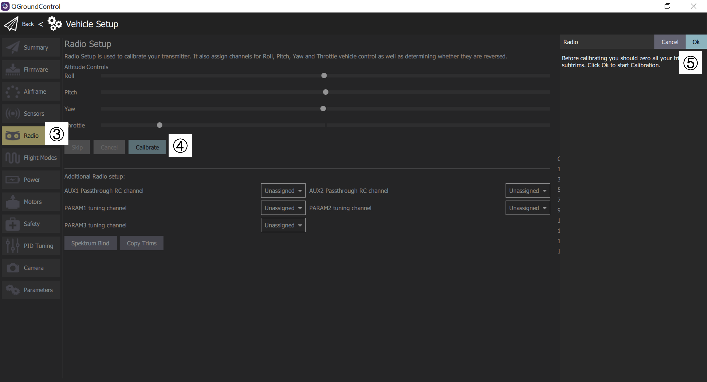
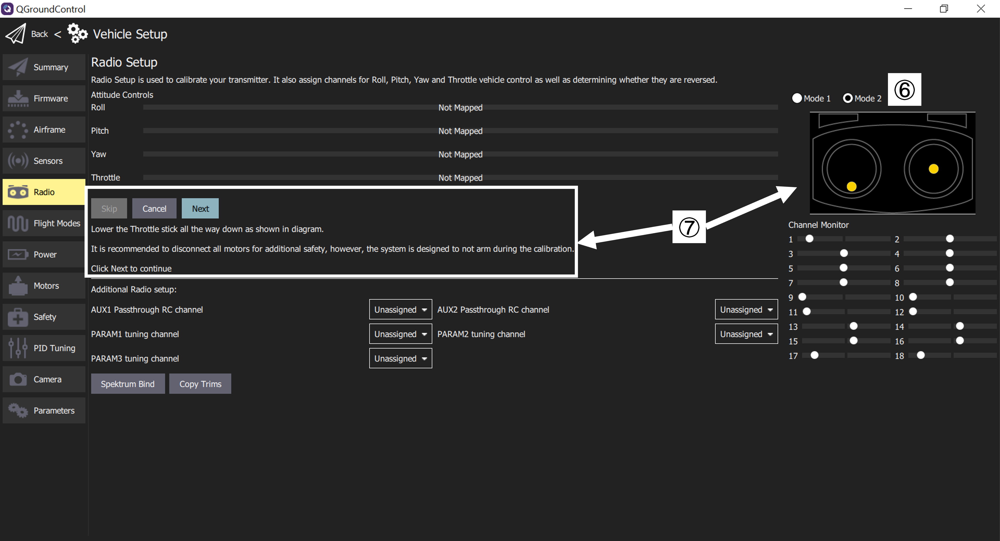
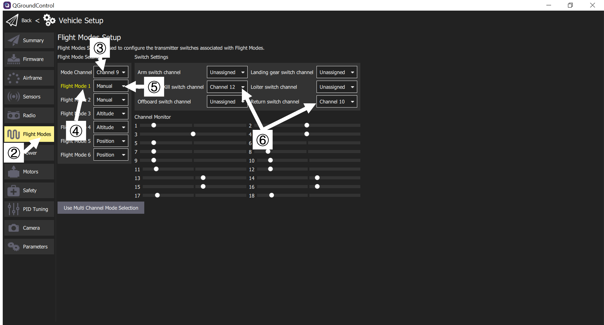

# Radio Setup

## Binding the Receiver

FrSky receiver, follow the instructions here [How to bind FrSky X8R receiver to Taranis X9D transmitter in D16 mode - YouTube](https://www.youtube.com/watch?v=1IYg5mQdLVI)

Steps for *FrSky L9R* receiver as an example:

1. Disconnect the receiver from power

2. Press and hold the *Failsave* (F/S) button while connect it to power
   
   * PX4 `RCIN` channel, receiver `SBUS` channel
   
   * The green and red lights will be on at the same time

3. Start binding on the transmitter
   
   * From the main interface, ***MENU*** > ***PAGE*** to open `MODEL SETUP` > near the bottom `Internal RF` > `Receiver No.` > `[bind]`, press ***ENT***, you will hear beep sound from the transmitter
   
   * On the receiver, the red light will be flashing, and green light remains on

4. Turn off the receiver and transmitter
   
   * turning off transmitter may not be necessary

5- Turn on both

* the green light will be on (red light off)

Binding process is completed

## RC Loss Detection

PX4 needs to detect signal loss from RC controller in order to take appropriate safety measures.

Ways of RE receivers indicating signal loss:

* Output nothing (automatically detected by PX4)

* Output a low throttle value (can configure PX4 to detect this)

* Output the last received signal (*<u>cannot</u>* be detected by PX4, as it looks like a valid input)

If RC receiver does not support no signal output on signal loss, you have to configure it to set throttle low instead, and set the corresponding value in `RC_FAILS_THR`

> DO NOT use a receiver that cannot support one of the two supported RC loss detection methods

## RC Calibration

Demo video [PX4 Autopilot Setup Tutorial Preview - YouTube](https://youtu.be/91VGmdSlbo4?t=4m30s)

1. Turn on RC transmitter

2. Start QGC and connect the vehicle

3. `Vehicle setup` > `Radio`

4. Press `Calibrate`

5. Press `OK` to start calibration
   
   * 

6. Select the transmitter mode that matches your transmitter
   
   * `Mode 2` by default

7. Follow the instructions and the diagram to finish the calibration
   
   7.1 Move the sticks to the position indicated by text and diagram
   
   7.2 Move all other switches and dials through their full range
   
   > For no responding when moving switches, please [map the switches to channels](file:///C:/D_Drive/github_repo/PX4-user_guide/notes/transmitter.pdf).
   
   * 

8. Press `Next` to save settings

# Flight Modes

> Prerequest: [Configured your radio](#radio_setup)

## Flight Modes and Switches to set

Flight modes should set:

* **Position mode** - Easiest and safest mode for manual flight

* **Return mode** - Return to launch position by safe path and land

* VTOL Transition Switch - not capable for quadrotors

Common modes:

* **Mission** - run a pre-programmed mission sent by ground control station

* **Kill Switch** - Immediately stops all motor outputs (the vehicle will crash, which may be more desirable than allowing it to continue flying in some circumstances)

## Flight Mode Selection

1. Connect the vehicle and turn on RC transmitter

2. QGC > `Vehicle Setup` > `Flight Modes`

3. Select the channel to control `Mode Channel`

4. Move the switch that set up for mode selection in step 3, the mode slot of the current switch position will be highlighted in yellow.

5. Select the flight mode for each switch position.
   
   * 

6. Select the channels you want to map to some specific actions, e.g. Return mode, Kill switch, etc.

> Mode Channel Channel 9
> 
>     Flight Mode 1 Manual
> 
>     Flight Mode 4 Altitude
> 
>     Flight Mode 6 Position
> 
> Emergency Kill switch channel Channel 12
> 
> Return switch channel Channel 10

# Battery

Methods can be used to estimate the capacity:

* **Basic Battery Settings**(default) - A coarse estimation by comparing the raw measured voltage to the voltage range of "empty" to "full".

* **Voltage-based Estimation with Load Compensation** - Counteracts the effects of loading on the capacity calculation.

* **Voltage-based Estimation with Current Integration** - Fuses the load-compensated voltage-based estimate for the available capacity with a current-based estimate of the charge that has been consumed. This results in a capacity estimate that is comparable to that of a smart battery.

> To ensure the battery failsafe is managed by PX4 instead of ESC, disable ESC's low voltage cutoff or set it below expected minimum voltage.

[Battery-Type Comparison](#battery-type-comparison) below explains the difference between the main battery types, and how that impacts the battery settings.

> The parameters `BAT1_xxx` used in the following refers to battery 1, if more than one battery is used, just replace `1` by the corresponding battery number.

## Basic Battery Settings (default)

Configuration of basic settings for <u>battery 1</u>:

1. Connect vehicle
   
   

2. QGC > `Vehicle Setup` > `Power`

3. Set number of cells (in Series) `BAT1_N_CELLS`
   
   > If the number of cells is not supplied, it can be calculated by dividing the battery voltage by nominal voltage (3.7V)

4. Set Empty Voltage (per cell) `BAT1_V_EMPTY`
   
   * Value too low may over-discharge and damage the battery, too high may limit the flight time
   
   * A rule of thumb for LiPo:
     
     * "Real" minimum (voltage under load/while flying : **<u>3.5V</u>**
     
     * Conservative (voltage under no-load): 3.7V

5. Set Full Voltage (per cell) `BAT1_V_FULL`
   
   * LiPo: 4.05V (default in QGroundControl)

6. Set Voltage Divider `BAT1_V_DIV`
   
   * Measure the battery voltage using a multimeter
   
   * Click `Calculate` beside `Voltage divider`
   
   * Key in the voltage value measured above to `Measured voltage`
   
   * Click `Calculate`, and `Close` the pop-up window

7. Set Amps per volt `BAT1_A_PER_V`
   
   > Not needed for basic configuration
   
   * Measure the current of the battery
   
   * Click `Calculate` beside `Amps per volt`
   
   * Key in the current value measured above to `Measured current`
   
   * Click `Calculate`, and `Close` the pop-up window
   
   * 

## Voltage-based Estimation with Load Compensation

Follow [the basic configuration](#basic_settings), but set a higher value (than without compensation) for *Empty Voltage* (`BAT_V_EMPTY`). Then perform one of the following methods by setting either of the two parameters:

* **Current-based Load Compensation (recommended)**
1. Set parameter `BAT1_R_INTERNAL` to the internal resistance of battery 1 (and other batteries for the parameter respectively)
   
   > There are LiPo chargers can measure the internal resistance. A typical value is 5mΩ per cell, this can vary with discarge current rating, age and health of the cells

2. Calibrate *Amps per volt divider* in the basic settings
* **Thrust-based Load Compensation**
1. Set the parameter `BAT1_V_LOAD_DROP` to the voltage drop a cell under the load of full throttle

## Voltage-based Estimation with Current Integration

1. Follow the steps in [current-based load compensation](#current_based_load_compensation), including *calibrating the Amps per volt divider*

2. Set `BAT1_CAPACITY` to around 90% of the advertised battery capacity (it usually printed on the battery label)

> This would give you a very accurate measurement of the relative battery consumption. If set up correctly, and with a healthy and fresh charged battery on every boot, the estimation quality will be comparable to that from a smart battery.

## Battery Type Comparison

**Overview**

* Li-Ion batteries have a higher energy density than LiPo battery packs but lower discharge rate and higher battery cost.

* LiPo are readily available and common in multi-roter aircraft

* **LiPo**
  
  * Advantages
    
    * Wide range of sizes, capacities and voltages
    
    * Inexpensive
    
    * High charge rates and C ratings (discharge rates relative to capacity)
  
  * Disadvantages
    
    * Low energy density (relative to Li-Ion)

* **Li-Ion**
  
  * Advantages
    
    * High energy density (up to 60% higher)
  
  * Disadvantages
    
    * Expensive
    
    * Limited choices of size and configurations
    
    * Lower charge rates and C rating
    
    * Difficult to adapt to vehicles that require high currents
    
    * Requires more stringent temperature monitoring during charge and discharge

**C Ratings**

* A C rating is simply a multiple of the stated capacity of any battery type.

* relevant to but differs from both charge and discharge rates.
  
  * Example: 2000 mAh battery (irrespective of voltage) with a 10C discharge rate can safely and continously discharge 20 amps of current ( 2000\text{mAh} \times 10\text{C} = 2\text{Ah} \times 10\text{C} = 20 \text{A} )

* C Rating is always given by the manufacturer (often on the outside of the battery pack)
  
  * It can actually be calculated, with serval pieces of information including the measurement of internal resistance of cells.

* Following manufacturer guidelines for both charge and discharge C ratings is very important for the health of your battery and to operate your vehicle safely
  
  * i.e. reduce fires, “puffing” packs and other suboptimal states during charging and discharging

# Safety Configuration (Failsafe)

Safety features to protect and recover vehicle if something goes wrong:

* <u>Failsafe</u> allow you to specify areas and conditions under which you can safely fly, and the [action](#failsafe-actions) that will be performed if a failsafe is triggered
  
  * The most important failsafe settings are configured in QGC `Safety Setup` [page](#qgroundcontrol-safety-setup), others can be configured via [parameters](#other-safety-settings).

* [Safety switches](#emergency-switches) on the remote control can be used to immediately stop motors or return the vehicle in the event of a problem.

## Failsafe Actions

Some of the common failsafe actions:

| Action             | Description                                                                                                                                                                                                                                                                                                |
| ------------------ | ---------------------------------------------------------------------------------------------------------------------------------------------------------------------------------------------------------------------------------------------------------------------------------------------------------- |
| None/Disabled      | No action (the failsafe will be ignored).                                                                                                                                                                                                                                                                  |
| Warning            | A warning message will be sent to *QGroundControl*.                                                                                                                                                                                                                                                        |
| Hold mode          | The vehicle will enter *Hold mode*.  Hover for multicopters, circle for fixed wing.                                                                                                                                                                                                                     |
| Return mode        | The vehicle will enter *Return mode*.  Return behaviour can be set in the [Return Home Settings](#return-mode-settings) (below).                                                                                                                                                                        |
| Land mode          | The vehicle will enter *Land mode*, and lands immediately.                                                                                                                                                                                                                                                 |
| Flight termination | Turns off all controllers and sets all PWM outputs to their failsafe values (e.g. `PWM_MAIN_FAILn`, `PWM_AUX_FAILn`).  The failsafe outputs can be used to deploy a parachute, landing gear or perform another operation. For a fixed-wing vehicle this might allow you to glide the vehicle to safety. |
| Lockdown           | Kills the motors (sets them to disarmed). This is the same as using the [kill switch](#kill-switch).                                                                                                                                                                                                       |

> The vehicle can recover from a failsafe action by switching modes, if the cause is fixed. For example, the vehicle is in *Return Mode* due to *RC Loss failsafe*, if the RC is recovered you can change to *Position mode* and continue the flight.

> If a failsafe occurs while the vehicle is responding to another failsafe (e.g. low battery while in Return mode due to RC Loss), the action for the second trigger is ignored. Instead the action is determined by separate system level and vehicle specific code. This might result in the vehicle being changed to a manual mode so the user can directly manage recovery.

## QGroundControl Safety Setup

The safety setup page can be found in QGC > `Vehicle Setup` > `Safety`.

### Low Battery Failsafe

The low battery failsafe is triggered when <u>the battery capacity drops below the level values</u>.

Recommended Setting:

* Failsafe Action: Return at critical level, land at emergency level

* Battery Warn level: 15%

* Battery Failsafe level: 7%

* Battery Emergency level: 5%

| Setting                 | Parameter                                                                                               | Description                                                                                                                                                                    |
| ----------------------- | ------------------------------------------------------------------------------------------------------- | ------------------------------------------------------------------------------------------------------------------------------------------------------------------------------ |
| Failsafe Action         | [COM_LOW_BAT_ACT](https://docs.px4.io/main/en/advanced_config/parameter_reference.html#COM_LOW_BAT_ACT) | Warn, Return, or Land based when capacity drops below <u>Battery Failsafe Level</u>(setting below), OR Warn, then return, then land based on each of the level settings below. |
| Battery Warn Level      | [BAT_LOW_THR](https://docs.px4.io/main/en/advanced_config/parameter_reference.html#BAT_LOW_THR)         | Percentage capacity for warnings (or other actions).                                                                                                                           |
| Battery Failsafe Level  | [BAT_CRIT_THR](https://docs.px4.io/main/en/advanced_config/parameter_reference.html#BAT_CRIT_THR)       | Percentage capacity for Return action (or other actions if a single action selected).                                                                                          |
| Battery Emergency Level | [BAT_EMERGEN_THR](https://docs.px4.io/main/en/advanced_config/parameter_reference.html#BAT_EMERGEN_THR) | Percentage capacity for triggering Land (immediately) action.                                                                                                                  |

### RC Loss Failsafe

The RC Loss failsafe may be triggered if <u>the RC transmitter link is lost in manual modes</u> (by default RC loss does not trigger the failsafe in missions, hold mode, or offboard mode).

* Failsafe Action: Return mode

* RC Loss Timeout: 0.5s

| Setting                | Parameter                                                                                             | Description                                                                                                                          |
| ---------------------- | ----------------------------------------------------------------------------------------------------- | ------------------------------------------------------------------------------------------------------------------------------------ |
| RC Loss Timeout        | [COM_RC_LOSS_T](https://docs.px4.io/main/en/advanced_config/parameter_reference.html#COM_RC_LOSS_T)   | Time after RC stops updating supplied data that the RC link is considered lost.                                                      |
| RC Loss Action Timeout | [COM_RCL_ACT_T](https://docs.px4.io/main/en/advanced_config/parameter_reference.html#COM_RCL_ACT_T)   | Timeout after RC link loss waiting to recover RC before the failsafe action is triggered. In this stage the vehicle is in hold mode. |
| Failsafe Action        | [NAV_RCL_ACT](https://docs.px4.io/main/en/advanced_config/parameter_reference.html#NAV_RCL_ACT)       | Disabled, Loiter, Return, Land, Terminate, Lockdown.                                                                                 |
| RC Loss Exceptions     | [COM_RCL_EXCEPT](https://docs.px4.io/main/en/advanced_config/parameter_reference.html#COM_RCL_EXCEPT) | Set the modes in which RC loss is ignored: Mission (default), Hold, Offboard.                                                        |

### Data Link Loss Failsafe

The Data Link Loss failsafe is triggered if <u>a telemetry link (connection to ground station) is lost when flying a mission</u>.

* Failsafe Action: Return mode

* Data Link Loss Timeout: 10s

| Setting                | Parameter                                                                                           | Description                                                                       |
| ---------------------- | --------------------------------------------------------------------------------------------------- | --------------------------------------------------------------------------------- |
| Data Link Loss Timeout | [COM_DL_LOSS_T](https://docs.px4.io/main/en/advanced_config/parameter_reference.html#COM_DL_LOSS_T) | Amount of time after losing the data connection before the failsafe will trigger. |
| Failsafe Action        | [NAV_DLL_ACT](https://docs.px4.io/main/en/advanced_config/parameter_reference.html#NAV_DLL_ACT)     | Disabled, Hold mode, Return mode, Land mode, Terminate, Lockdown.                 |

### Geofence Failsafe

The Geofence Failsafe will trigger if <u>the vehicle moves outside the radius or above the altitude of the geofence</u>.

| Setting          | Parameter                                                                                               | Description                                                     |
| ---------------- | ------------------------------------------------------------------------------------------------------- | --------------------------------------------------------------- |
| Action on breach | [GF_ACTION](https://docs.px4.io/main/en/advanced_config/parameter_reference.html#GF_ACTION)             | None, Warning, Hold mode, Return mode, Terminate*, Land.        |
| Max Radius       | [GF_MAX_HOR_DIST](https://docs.px4.io/main/en/advanced_config/parameter_reference.html#GF_MAX_HOR_DIST) | Horizontal radius of geofence cylinder. Geofence disabled if 0. |
| Max Altitude     | [GF_MAX_VER_DIST](https://docs.px4.io/main/en/advanced_config/parameter_reference.html#GF_MAX_VER_DIST) | Height of geofence cylinder. Geofence disabled if 0.            |

> * *Terminate* in `GF_ACTION` means killing the vehicle on violation of the fence, but disabled by default. To enable this, set `CBRK_FLIGHTTERM`(below) to `0`.

Settings not displayed in QGC UI:

| Setting                                | Parameter                                                                                               | Description                                                                                                           |
| -------------------------------------- | ------------------------------------------------------------------------------------------------------- | --------------------------------------------------------------------------------------------------------------------- |
| Geofence altitude mode                 | [GF_ALTMODE](https://docs.px4.io/main/en/advanced_config/parameter_reference.html#GF_ALTMODE)           | Altitude reference used: 0 = WGS84, 1 = AMSL.                                                                         |
| Geofence counter limit                 | [GF_COUNT](https://docs.px4.io/main/en/advanced_config/parameter_reference.html#GF_COUNT)               | Set how many subsequent position measurements outside of the fence are needed before geofence violation is triggered. |
| Geofence source                        | [GF_SOURCE](https://docs.px4.io/main/en/advanced_config/parameter_reference.html#GF_SOURCE)             | Set whether position source is estimated global position or direct from the GPS device.                               |
| Circuit breaker for flight termination | [CBRK_FLIGHTTERM](https://docs.px4.io/main/en/advanced_config/parameter_reference.html#CBRK_FLIGHTTERM) | Enables/Disables flight termination action (disabled by default).                                                     |

### Return Mode Settings

| Setting           | Parameter                                                                                               | Description                                                                                            |
| ----------------- | ------------------------------------------------------------------------------------------------------- | ------------------------------------------------------------------------------------------------------ |
| Climb to altitude | [RTL_RETURN_ALT](https://docs.px4.io/main/en/advanced_config/parameter_reference.html#RTL_RETURN_ALT)*  | Vehicle ascend to this minimum height (if below it) for the return flight.                             |
| Return behaviour  |                                                                                                         | Choice list of *Return then*: Land, Loiter and do not land, or Loiter and land after a specified time. |
| Loiter Altitude   | [RTL_DESCEND_ALT](https://docs.px4.io/main/en/advanced_config/parameter_reference.html#RTL_DESCEND_ALT) | If return with loiter is selected you can also specify the altitude at which the vehicle hold.         |
| Loiter Time       | [RTL_LAND_DELAY](https://docs.px4.io/main/en/advanced_config/parameter_reference.html#RTL_LAND_DELAY)   | If return with loiter then land is selected you can also specify how long the vehicle will hold.       |

> * The return behaviour is defined by RTL_LAND_DELAY.
>   If negative the vehicle will land immediately.
>   Additional information can be found in [Return Mode](https://docs.px4.io/main/en/flight_modes/return.html)

### Land Mode Settings

| Setting              | Parameter                                                                                               | Description                                                                                                                          |
| -------------------- | ------------------------------------------------------------------------------------------------------- | ------------------------------------------------------------------------------------------------------------------------------------ |
| Disarm After         | [COM_DISARM_LAND](https://docs.px4.io/main/en/advanced_config/parameter_reference.html#COM_DISARM_LAND) | Select checkbox to specify that the vehicle will disarm after landing. The value must be non-zero but can be a fraction of a second. |
| Landing Descent Rate | [MPC_LAND_SPEED](https://docs.px4.io/main/en/advanced_config/parameter_reference.html#MPC_LAND_SPEED)   | Rate of descent (MC only).                                                                                                           |

## Other Failsafe Settings

The failsafe settings cannot be configured through QGC `Safety Setup` page

### Position (GPS) Loss Failsafe

The *Position Loss Failsafe* is triggered if <u>the quality of the PX4 position estimate falls below acceptable levels</u> (this might be caused by GPS loss) while in a mode that requires an acceptable position estimate.

The failure action is controlled by `COM_POSCTL_NAVL`, based on whether <u>RC control (and altitude information)</u> is assumed to be available:

* `0`: RC available. Switch to `Altitude mode` if height estimate is available, otherwise `Stablized mode` (`Manual/Stabilized mode` for Multicopter).

* `1`: RC not available. Switch to `Land mode` if height estimate is available, otherwise enter flight termination.

| Parameter                                                                                                 | Description                                                                                               |
| --------------------------------------------------------------------------------------------------------- | --------------------------------------------------------------------------------------------------------- |
| [COM_POS_FS_DELAY](https://docs.px4.io/main/en/advanced_config/parameter_reference.html#COM_POS_FS_DELAY) | Delay after loss of position before the failsafe is triggered.                                            |
| [COM_POSCTL_NAVL](https://docs.px4.io/main/en/advanced_config/parameter_reference.html#COM_POSCTL_NAVL)   | Position control navigation loss response during mission. Values: 0 - assume use of RC, 1 - Assume no RC. |
| [CBRK_VELPOSERR](https://docs.px4.io/main/en/advanced_config/parameter_reference.html#CBRK_VELPOSERR)     | Circuit breaker for position error check (disables error checks in all modes).                            |

For Fixed Wings only:

| Parameter                                                                                       | Description                                                                                         |
| ----------------------------------------------------------------------------------------------- | --------------------------------------------------------------------------------------------------- |
| [NAV_GPSF_LT](https://docs.px4.io/main/en/advanced_config/parameter_reference.html#NAV_GPSF_LT) | Loiter time (waiting for GPS recovery before it goes into flight termination). Set to 0 to disable. |
| [NAV_GPSF_P](https://docs.px4.io/main/en/advanced_config/parameter_reference.html#NAV_GPSF_P)   | Fixed pitch angle while circling.                                                                   |
| [NAV_GPSF_R](https://docs.px4.io/main/en/advanced_config/parameter_reference.html#NAV_GPSF_R)   | Fixed roll/bank angle while circling.                                                               |
| [NAV_GPSF_TR](https://docs.px4.io/main/en/advanced_config/parameter_reference.html#NAV_GPSF_TR) | Thrust while circling.                                                                              |

### Offboard Loss Failsafe

The *Offboard Loss Failsafe* is triggered if <u>the offboard link is lost while under Offboard control</u>. Different failsafe behaviour can be specified based on whether or not there is also an RC connection available.

| Parameter                                                                                             | Description                                                                                                       |
| ----------------------------------------------------------------------------------------------------- | ----------------------------------------------------------------------------------------------------------------- |
| [COM_OF_LOSS_T](https://docs.px4.io/main/en/advanced_config/parameter_reference.html#COM_OF_LOSS_T)   | Delay after loss of offboard connection before the failsafe is triggered.                                         |
| [COM_OBL_ACT](https://docs.px4.io/main/en/advanced_config/parameter_reference.html#COM_OBL_ACT)       | Failsafe action if no RC is available: Land mode, Hold mode, Return mode.                                         |
| [COM_OBL_RC_ACT](https://docs.px4.io/main/en/advanced_config/parameter_reference.html#COM_OBL_RC_ACT) | Failsafe action if RC is available: Position mode, Altitude mode, Manual mode, Return mode, Land mode, Hold mode. |

### Mission Failsafe

The mission Failsafe will prevent a previous mission being started at a new takeoff location or if the distance between waypoints is too great. The failsafe action is stop the mission from running.

| Parameter                                                                                         | Description                                                                                                                                     |
| ------------------------------------------------------------------------------------------------- | ----------------------------------------------------------------------------------------------------------------------------------------------- |
| [MIS_DIST_1WP](https://docs.px4.io/main/en/advanced_config/parameter_reference.html#MIS_DIST_1WP) | The mission will not be started if the current waypoint is more distant than this value from the home position. Disabled if value is 0 or less. |
| [MIS_DIST_WPS](https://docs.px4.io/main/en/advanced_config/parameter_reference.html#MIS_DIST_WPS) | The mission will not be started if any distance between two subsequent waypoints is greater than this value. Disable if value is 0 or less.     |

### Traffic Avoidance Failsafe

The Traffic Avoidance Failsafe allows PX4 to respond to transponder data (e.g. from [ADSB transponders](https://docs.px4.io/main/en/advanced_features/traffic_avoidance_adsb.html)) during missions.

| Parameter                                                                                               | Description                                                      |
| ------------------------------------------------------------------------------------------------------- | ---------------------------------------------------------------- |
| [NAV_TRAFF_AVOID](https://docs.px4.io/main/en/advanced_config/parameter_reference.html#NAV_TRAFF_AVOID) | Set the failsafe action: Disabled, Warn, Return mode, Land mode. |

### QuadChute Failsafe

For VTOL can no longer fly in fixed-wing mode.

## Failure Detector

The failure detector allows a vehicle to take protective action(s) if it <u>unexpectedly flips</u>, or if it is <u>notified by an external failure detection system</u>.

> Failure detection is deactivated by default, enabling by setting the parameter `CBRK_FLIGHTTERM`=`0`

During **takeoff**, the failure detector <u><strong>attitude trigger</strong></u> invokes the [lockdown action](#action_lockdown) if the vehicle flips. The flip check is ***always enabled*** on takeoff, not affect by `CBRK_FLIGHTTERM`.

The failure detector is active in all vehicle types and modes, expect for those where vehicle is expected to do flips (i.e. Acro mode for MC & FW, Manual for FW)

### Attitude Trigger

The failure detector can be configured to trigger if <u>the vehicle attitude exceeds predefined pitch and roll values for longer than a specified time</u>.

| Parameter                                                                                               | Description                                                                                                                      |
| ------------------------------------------------------------------------------------------------------- | -------------------------------------------------------------------------------------------------------------------------------- |
| [CBRK_FLIGHTTERM](https://docs.px4.io/main/en/advanced_config/parameter_reference.html#CBRK_FLIGHTTERM) | Flight termination circuit breaker. Unset from 121212 (default) to enable flight termination due to FailureDetector or FMU loss. |
| [FD_FAIL_P](https://docs.px4.io/main/en/advanced_config/parameter_reference.html#FD_FAIL_P)             | Maximum allowed pitch (in degrees).                                                                                              |
| [FD_FAIL_R](https://docs.px4.io/main/en/advanced_config/parameter_reference.html#FD_FAIL_R)             | Maximum allowed roll (in degrees).                                                                                               |
| [FD_FAIL_P_TTRI](https://docs.px4.io/main/en/advanced_config/parameter_reference.html#FD_FAIL_P_TTRI)   | Time to exceed [FD_FAIL_P](#FD_FAIL_P) for failure detection (default 0.3s).                                                     |
| [FD_FAIL_R_TTRI](https://docs.px4.io/main/en/advanced_config/parameter_reference.html#FD_FAIL_R_TTRI)   | Time to exceed [FD_FAIL_R](#FD_FAIL_R) for failure detection (default 0.3s).                                                     |

### External Automatic Trigger System (ATS)

The failure detector, if enabled (`CBRK_FLIGHTTERM`=`0`) can also be triggered by an external ATS system. The external trigger system must be connected to port `AUX5` ( or `MAIN5` if don't have AUX ports).

| Parameter                                                                                               | Description                                                                                                                                      |
| ------------------------------------------------------------------------------------------------------- | ------------------------------------------------------------------------------------------------------------------------------------------------ |
| [FD_EXT_ATS_EN](https://docs.px4.io/main/en/advanced_config/parameter_reference.html#FD_EXT_ATS_EN)     | Enable PWM input on AUX5 or MAIN5 (depending on board) for engaging failsafe from an external automatic trigger system (ATS). Default: Disabled. |
| [FD_EXT_ATS_TRIG](https://docs.px4.io/main/en/advanced_config/parameter_reference.html#FD_EXT_ATS_TRIG) | The PWM threshold from external automatic trigger system for engaging failsafe. Default: 1900 ms.                                                |

## Emergency Switches

RC switches can be configured to allow pilot take rapid corrective action when problem or emergency.

> Configurations of switches are in [Flight Mode Setup](#flight_mode)

### Kill Switch

* Immediately stops all motor
  
  * **if flying, the vehicle will fall**

* Kill switch reverted <u>within 5 seconds</u>, motors will restart

* After 5 seconds, the vehicle will disarm
  
  * need to arm again to start motors

### Arm/Disarm Switch

* A direct replacement for the default stick-based arming/disarming mechanism

* Having the same purpose as the default mechanism
  
  * an intentional step before motors start/stop

* Preferred than the default mechanism
  
  * avoids accidentally triggering arming/disarming in-air with a certain stick motion
  
  * no delay

* Modes support disarming in flight:
  
  * Manual mode
  
  * Acro mode
  
  * Stabilized mode

* Modes not support disarming <u>in flight </u> will ignore the disarm switch during flight, but may be used after landing is detected.
  
  * Position mode
  
  * Autonomous modes (e.g. Mission, Land etc.)

> [Auto disarm timeouts](https://docs.px4.io/main/en/config/safety.html#auto-disarming-timeouts) (e.g. via [COM_DISARM_LAND](https://docs.px4.io/main/en/config/safety.html#COM_DISARM_LAND)) are independent of the arm/disarm switch - ie even if the switch is armed the timeouts will still work.

### Return Switch

immediately engage Return mode

## Other Safety Settings

### Auto-disarming Timeouts

automatically disarm if too slow to takeoff and/or after landing.

| Parameter                                                                                                 | Description                                                |
| --------------------------------------------------------------------------------------------------------- | ---------------------------------------------------------- |
| [COM_DISARM_LAND](https://docs.px4.io/main/en/advanced_config/parameter_reference.html#COM_DISARM_LAND)   | Timeout for auto-disarm after landing.                     |
| [COM_DISARM_PRFLT](https://docs.px4.io/main/en/advanced_config/parameter_reference.html#COM_DISARM_PRFLT) | Timeout for auto disarm if vehicle is too slow to takeoff. |

# Motor

> This section is being replaced by an Actuators configuration screen.

<mark>\* check how to change the direction of the motor rotation</mark>
