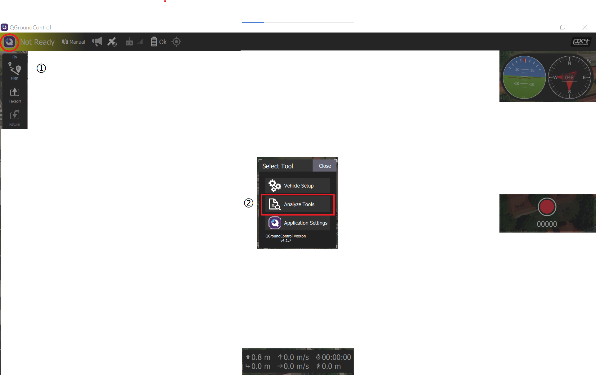

**Getting started**

# Basic Concepts

## PX4 Autopilot - Flight controller

* Controls [many different vehicle frames/types](https://docs.px4.io/main/en/airframes/airframe_reference.html), including: aircraft (multicopters, fixed wing aircraft and VTOLs), ground vehicles and underwater vehicles.

* [Quadrotor x](https://docs.px4.io/main/en/airframes/airframe_reference.html#quadrotor-x)
  
  

    
    

## QGroundControl - Drone code ground control station

* load (flash) PX4 onto vehicle control hardware
* setup vehicle
* change different parameters
* get real-time flight info
* create & execute fully autonomous missions

## Radio Control (RC)

* manually control the vehicle
* more topics related introduced later

## Safety Switch

* A switch that must be engaged before the vehicle can be armed.
  * for arming and disarming, see the section [below](#arming-and-disarming)
* Commonly integrated into a GPS unit
  * could also be a separated physical component

## Data/Telemetry Radios

[Data/Telemetry Radios](https://docs.px4.io/main/en/telemetry/) can provide a wireless MAVLink connection between a ground control station like *QGroundControl* and a vehicle running PX4. This makes it possible to tune parameters while a vehicle is in flight, inspect telemetry in real-time, change a mission on the fly, etc.

## Arming and Disarming 

> Vehicles may have moving parts, some of which are dangerous when powered (in particular motors and propellers)!

Three power states defined by PX4:

* **Disarmed**: All motors and actuators are unpowered.

* **Prearmed**: Motors are unpowered, actuators are powered (allowing non-dangerous actuators to be bench-tested).

* **Armed:** Motors and other actuators are powered, and propellers may be spinning.
  
  > **<u>Arm vehicles only when necessary!!!</u>**

## Heading and Directions

# Sensors

## GPS & compass

> We recommend the use of an external "combined" compass/GPS module mounted as <u>far away from</u> the **motor/ESC power supply lines** as possible - typically on a pedestal or wing (for fixed-wing).

## Airspeed sensors

* Essential in detecting stall
* (For fixed-wing flight), it is the airspeed that guarantees lift not ground speed

## Tachometers

## Distance sensors

## Optical Flow sensors

# Radio Control Systems

A radio control (RC) system is required if you want to *manually* control your vehicle from a handheld transmitter.

In autonomous flight modes, remote control system is not required

> To disable RC checks, setting parameter `COM_RC_IN_MODE` to `1`

Term definition

* **Transmitter**: ground-based radio modules

* **Receiver**: vehicle-based radio modules

The number of channels the RC supports is an important quality

* channel refers to <u>switches, dials, control sticks can actually be used</u>

* at least 2 channels for ground vehicles (steering, throttle)

* at least 4 channels for aircrafts (roll, pitch, yaw, thrust)

* additional channels can be used for control other mechanisms or activate different flight modes

## Types of Remote Controls

# PX4 Flight Modes

## Switching Between Modes

Flight modes can be transited using switches on RC or ground control station

Not all modes are available on all vehicle types, some modes behave differently on different vehicle types

In **multicopter** <u>autonomous modes</u>, RC stick movement will change to position mode by default (unless handling a critical battery failsafe)

For autonomous fixed-wing flight, stick movement is ignored

# Autonomous and Manual Modes

Term definition

* **Manual**
  
  * user has control over vehicle movement via RC
  
  * may have autopilot-assisted mechanisms to make flight easier
  
  * > e.g. most modes will level out the vehicle when the RC sticks are centered
  
  * Can be further divided into "easy" and "acrobatic" modes
  
  * In **easy** mode, roll and pitch sticks control vehicle angle
    
    * impossible to flip
  
  * In **acrobatic** mode, the stickes control rate of angular rotation
    
    * can flip
    
    * more maneuverable, harder to fly
  
  * Autonomous
    
    * fully controlled by autopilot
    
    * input from pilot/remove control is not required

Multicopter:

* Manual-Easy: [Position](https://docs.px4.io/main/en/getting_started/flight_modes.html#position-mode-mc), [Altitude](https://docs.px4.io/main/en/getting_started/flight_modes.html#altitude-mode-mc), [Manual/Stabilized](https://docs.px4.io/main/en/getting_started/flight_modes.html#manual-stabilized-mode-mc), [Orbit](https://docs.px4.io/main/en/getting_started/flight_modes.html#orbit-mode-mc)
* Manual-Acrobatic: [Acro](https://docs.px4.io/main/en/getting_started/flight_modes.html#acro-mode-mc)
* Autonomous: [Hold](https://docs.px4.io/main/en/getting_started/flight_modes.html#hold-mode-mc), [Return](https://docs.px4.io/main/en/getting_started/flight_modes.html#return-mode-mc), [Mission](https://docs.px4.io/main/en/getting_started/flight_modes.html#mission-mode-mc), [Takeoff](https://docs.px4.io/main/en/getting_started/flight_modes.html#takeoff-mode-mc), [Land](https://docs.px4.io/main/en/getting_started/flight_modes.html#land-mode-mc), [Follow Me](https://docs.px4.io/main/en/getting_started/flight_modes.html#follow-me-mode-mc), [Offboard](https://docs.px4.io/main/en/getting_started/flight_modes.html#offboard-mode-mc)

## Legend

The icons below are used within the document:

*   Manual mode. Remote control required.
*    Automatic mode. RC control is disabled by default except to change modes. 
*   Position fix required (e.g. GPS, VIO, or some other positioning system).
*    Altitude required (e.g. from barometer, rangefinder). 
*     Flight mode difficulty (Easy to Hard) 

<!--
| **Icon**                                                                                                                                                                                    | **Description**                                                                                        |
|:-------------------------------------------------------------------------------------------------------------------------------------------------------------------------------------------:|--------------------------------------------------------------------------------------------------------|
|                                                                                                                                 | Manual mode. Remote control required.                                         |
|                                                                                                                                 | Automatic mode. RC control is disabled by default except to change modes.  |
|                                                                                                                                 | Position fix required (e.g. GPS, VIO, or some other positioning system).                               |
|                                                                                                                                  | Altitude required (e.g. from barometer, rangefinder).                                                  |
|    | Flight mode difficulty (Easy to Hard)                                                                  |
-->

## Multicopter

### Position Mode 位置模式 

  

Easy, manual, position

* Easy-to-fly RC mode
  * Roll and pitch sticks control acceleration over ground in vehicles forward-back and left-right directions
  * Throttle controls speed of ascent-descent
* When sticks are released/centered, the vehicle will actively brake, level and be **locked to a position**
  * The vehicle will stop when sticks are centered, rather than drifting

> Safest manual mode for new fliers

## Altitude Mode 定高模式 

  

Easy, manual, altitude

* _relatively_ easy-to-fly RC mode
  * Roll and pitch sticks control vehicle movement in the left-right and forward-back directions
  * Yaw stick controls <u>roation rate</u>
  * Throttle controls speed of ascent-descent
* When sticks are released/centered, the vehicle will level and **maintain the current altitude**.
  * The moving in the horizontal plane will continue until the momentum is dissipated by wind resistance
  * e.g. the wind could blow the aircraft to drift

> Safest _non-GPS_ manual mode for new fliers.

## Manual/Stabilized Mode 手动/自稳模式 

 

Medium, manual

* Mode
  * Roll and pitch sticks control the angle of the vehicle (attitude)
  * Yaw stick controls the rate of rotation above the horizontal plane
  * Throttle controls altitude/speed
* The control sticks will return to the center deadzone when released
  * The multicopter will level out and stop once the roll and pitch sticks are centered.
  * The vehicle will then hover in place/maintain altitude - provided it is properly balanced, throttle is set appropriately, and no external forces are applied (e.g. wind).
  * The craft will drift in the direction of any wind
    * have to control the throttle to hold altitude.

## Acro Mode 特技模式 

 

Hard, manual

* RC mode for performing acrobatic maneuvers e.g. rolls and loops.
  * The roll, pitch and yaw sticks control the **rate of angular rotation** around the respective axes
  * Throttle is passed directly to the output mixer
  * When sticks are centered the vehicle will stop rotating, but **remain in its current orientation** (on its side, inverted, or whatever) and moving according to its current momentum
    
    P.S. Up for left stick means move to the "top" direction of the vehicle, even when the vehicle is upside down 

## Orbit Mode 环绕模式 

 

Easy, position

* a mode to command a multicopter to fly in a circle
  * the vehicle keeps yawing so that it always faces towards the center
* <u>Ground control station (GCS)</u> is required
  * to set the center position and initial radius of the orbit
  * Default setting: 1m/s in clockwise direction
    

## Hold Mode 保持模式

&nbsp;

Auto, position

* stop and hover at its current position and altitude
  * maintaining position against wind and other forces
* used for <u>pause a mission</u> or help to <u>regain control</u> in emergency
* How to activate: 
  * pre-programmed RC switch, **pause** botton in QGC

## Return Mode返航模式 

&nbsp;

Auto, position

* fly to a clear path to a safe location
* How to activate: 
  * manually (pre-programmed RC switch)
  * automatically (i.e. failsafe triggered)

## Mission Mode 任务模式 

&nbsp;

Auto, position

* execute a predefined autonomous mission (flight plan)
  * The mission has to be uploaded to the flight controller in advance
  * typically created and uploaded with a GCS application (i.e. QGC)

## Takeoff Mode 起飞模式 

&nbsp;

Auto, position

* climb vertically to takeoff altitude and hover in position

## Land Mode 降落模式 

&nbsp;

Auto, position

* land at the location at which the mode was engaged.

## Follow Me Mode 跟随模式 

&nbsp;

Auto, position

* autonomously follow and track a user providing their current position setpoint. 
  * Position setpoints might come from a phone/tablet running _QGroundControl_ or from a MAVSDK app
    * currently QGC only available on Android

## Offboard Mode 外部模式 

&nbsp;

Auto, position

* obey a position, velocity or attitude setpoint provided over MAVLink.
  * This mode is intended for vehicle control from **companion computers and ground stations**!

# Vehicle Status Notifications

## LED lights

### UI LED

* provide user-facing status info related to readiness for flight
  
  > FMUv4 does not have one on board, and typically uses an LED mounted on the GPS

* **WARNING** GPS lock (green LED) does not guarentee the vehicle can be armed. PX4 has to **pass the preflight checks**. 

* In the event of an error (blinking red), or can't achieve GPS lock (change from blue to green), check details from QGC, including 
  
  * <u>calibration status, and error messages reported by the Preflight Checks (Internal)</u>
  * <u>GPS module is attached properly, Pixhawk is reading the GPS properly, and GPS is sending a proper GPS position</u>

* **[Solid Blue] Armed, No GPS Lock:** 
  * vehicle has been armed and has <u>no</u> position lock from a GPS unit.
  * PX4 unlocks control of the motors, allowing you to fly your drone.
  * vehicle **cannot** perform <u>guided missions</u> in this mode.
* **[Solid Green] Armed, GPS Lock:**
  * vehicle has been armed and has a valid position lock from a GPS unit.
  * PX4 unlocks control of the motors, allowing you to fly your drone.
  * vehicle can perform <u>guided missions</u> in this mode
* **[Solid Purple] Failsafe Mode:** 
  * vehicle encounters an issue during flight
    * losing manual control, 
    * a critically low battery, or 
    * an internal error
  * vehicle will attempt to return to its takeoff location, or may simply descend where it currently is.
* **[Solid Amber] Low Battery Warning:** 
  * vehicle's battery is running dangerously low
  * After a certain point, vehicle will go into failsafe mode
* **[Pulsing Blue] Disarmed, No GPS Lock:** 
  * vehicle is disarmed and has <u>no</u> position lock from a GPS unit
    * This means you will not be able to control motors, but all other subsystems are working.
* **[Pulsing Green] Disarmed, GPS Lock:** 
  * vehicle is disarmed and has a valid position lock from a GPS unit.
  * This means you will not be able to control motors, but all other subsystems including GPS position lock are working.
* **[Blinking Red] Error / Setup Required:** 
  * your autopilot needs to be configured or calibrated before flying
  * What to do: Attach your autopilot to a Ground Control Station to verify what the problem is.
    * If you have completed the setup process and autopilot still appears as red and flashing, there may be another error.

### Status LED

* provide status for PX4IO and FMU SoC, indicating power, bootloader mode and activity and errors
  
  _No lights on PX4, skipped_

## Tune Meanings

For sounds, refer to the webpage [Tune Meanings](https://docs.px4.io/main/en/getting_started/tunes.html). 

## Preflight Sensor/Estimator Checks

PX4 checks the quality and estimator of preflight sensors. To make sure it is a good position to arm and fly the vehicle (the checks are controlled by COM_ARM_*** parameters)

> the preflight errors are reported in QGC as `preflight fail` messages. The `estimator_status.gps_check_fail_flags` message in the logs also shows which GPS quality checks are failing.

* **PREFLIGHT FAIL: EKF HGT ERROR**
  
  * _COM\_ARM\_EKF\_HGT_
  * IMU and height measurement data are inconsistent
  * Perform an <u>accel and gyro calibration</u> and restart the vehicle. If the error persists, check the height sensor data for problems

* **PREFLIGHT FAIL: EKF VEL ERROR**
  
  * _COM\_ARM\_EKF\_VEL_
  * IMU and GPS velocity measurement data are inconsistent
  * Check the <u>GPS velocity data</u> for un-realistic data jumps. If GPS quality looks OK, perform an accel and gyro calibration and restart the vehicle.

* **PREFLIGHT FAIL: EKF HORIZ POS ERROR**
  
  * _COM\_ARM\_EKF\_POS_
  * <u>IMU and position measurement data</u> (either GPS or external vision) are inconsistent

* **PREFLIGHT FAIL: EKF YAW ERROR**
  
  * _COM\_ARM\_EKF\_YAW_
  * yaw angle estimated using gyro data and from the magnetometer or external vision system are inconsistent.
  * Check the <u>IMU data</u> for large yaw rate offsets and check the <u>magnetometer</u> alignment and calibration.
    * It can fail if the yaw gyro has a large offset or if the vehicle is moved or rotated in the presence of a bad magnetic interference or magnetometer calibration
  * The default value of 0.5 allows the differences between the navigation yaw angle and magnetic yaw angle (magnetometer or external vision) to be no more than 50% of the maximum tolerated by the EKF and provides some margin for error increase when flight commences.

* **PREFLIGHT FAIL: EKF HIGH IMU ACCEL BIAS**
  
  * _EKF2\_ABL\_LIM_, _EKF2\_ABIAS\_INIT_, _EKF2\_ACC\_B\_NOISE_, _KF2\_ABL\_ACCLIM_
  * Definition of EKF IMU acceleration bias: 
    * the difference between the <u>measured acceleration reported by the IMU sensor</u> and the <u>expected acceleration reported by the EKF2 estimator</u> (which fuses position and/or velocity data from a number of sources, including the IMU, GNSS, flow sensors etc.).
    * This bias should generally be very small (near zero), indicating that measurements from different sources all agree on the acceleration
    * The bias may change when 
      * the sensor is turned on (“turn-on bias”) and 
      * over time due to noise and temperature differences (“in-run bias”)
  * the bias is higher than some arbitrary threshold (the vehicle will not be allowed to take off). It is most likely a sign that <u>accelerometer or thermal calibration</u> are required:
    * _sometimes_ get the warning: **re-calibrate the accelerometer**
    * _regularly_ get the warning: Perform a **thermal calibration**
    * can't perform thermal calibration or still warning after thermal calibration:
      * Verify that the issues do not come from the sensor or autopilot hardware
        * (easiest way) <u>test the same frame/sensors with another autopilot</u>
        * Alternatively, [log and compare](https://docs.px4.io/main/en/dev_log/logging.html#configuration) all accelerometers across a number of bench test runs with `6: Sensor comparison` enabled in [SDLOG_PROFILE](https://docs.px4.io/main/en/advanced_config/parameter_reference.html#SDLOG_PROFILE).
      * Attempt to change the accelerometer bias learning tuning parameters

* **PREFLIGHT FAIL: EKF HIGH IMU GYRO BIAS**
  
  * IMU gyro bias estimated by the EKF is excessive
  * the bias estimate exceeds 10deg/s (half the configured limit, which is hardcoded to 20deg/s)

* **PREFLIGHT FAIL: ACCEL SENSORS INCONSISTENT - CHECK CALIBRATION**
  
  * _COM\_ARM\_IMU\_ACC_
  * (only applies to boards with more than one IMU)
  * angular rate measurements from different IMU units are inconsistent

* **PREFLIGHT FAIL: GYRO SENSORS INCONSISTENT - CHECK CALIBRATION**
  
  * _COM\_ARM\_IMU\_GYR_
  * (only applies to boards with more than one IMU)
  * the angular rate measurements from different IMU units are inconsistent.

* **PREFLIGHT FAIL: COMPASS SENSORS INCONSISTENT - CHECK CALIBRATION**
  
  * _COM\_ARM\_MAG\_ANG_
  * (only applies to when more than one compass/magnetometer is connected)
  * the difference in measurements from different compass sensors is too great, indicating bad calibration, orientation or magnetic interference.

* **PREFLIGHT FAIL: EKF INTERNAL CHECKS**
  
  * the innovation magnitudes of either the <u>horizontal GPS velocity</u>, <u>magnetic yaw</u>, <u>vertical GPS velocity</u> or <u>vertical position sensor</u> (Baro by default but could be range finder or GPS if non-standard parameters are being used) are excessive
    * Innovations are the difference between the value predicted by the inertial navigation calculation and measured by the sensor.
  * Users should check the innovation levels in the log file to determine the cause. These can be found under the `ekf2_innovations` message. Common problems/solutions include:
    * IMU drift on warmup. May be resolved by <u>restarting the autopilot</u>. May require an <u>IMU accel and gyro calibration</u>.
    * Adjacent magnetic interference combined with vehicle movement. Resolve by <u>moving vehicle and waiting or re-powering</u>.
    * Bad magnetometer calibration combined with vehicle movement. Resolve by <u>recalibrating magnetometer</u>.
    * Initial shock or rapid movement on startup that caused a bad inertial nav solution. Resolve by <u>restarting the vehicle and minimising movement for the first 5 seconds</u>.

* **COM\_ARM\_WO_GPS**
  
  * The [COM\_ARM\_WO_GPS](https://docs.px4.io/main/en/advanced_config/parameter_reference.html#COM_ARM_WO_GPS) parameter controls whether or not arming is allowed without a global position estimate.
  * `1` (default): Arming _is_ allowed without a position estimate for flight modes that do not require position information (only)
  * `0`: Arming is allowed only if EKF is providing a global position estimate and EFK GPS quality checks are passing

# Payloads and Cameras

* Payloads are connected to Flight Controller outputs
* generally, can be triggered automatically in missions, or manually using RC passthrough or MAVLink/MAVSDK commands

> Payloads (actuators) can be tested in **pre-arm state**, movement of actuators are allowed but motors are disabled. 
> _skipped_

# Flight Reporting

## Download logs from Flight Controller

In QGroundControl: Analyze View > Log Download

## Analyzing logs

Upload the log file to the online tool [Flight Review](http://logs.px4.io/) (https://logs.px4.io/)

[Log Analysis using Flight Review](https://docs.px4.io/main/en/log/flight_review.html) explains how to interpret the plots, and can help you to verify/reject the causes of common problems: excessive vibration, poor PID tuning, saturated controllers, imbalanced vehicles, GPS noise, etc.
